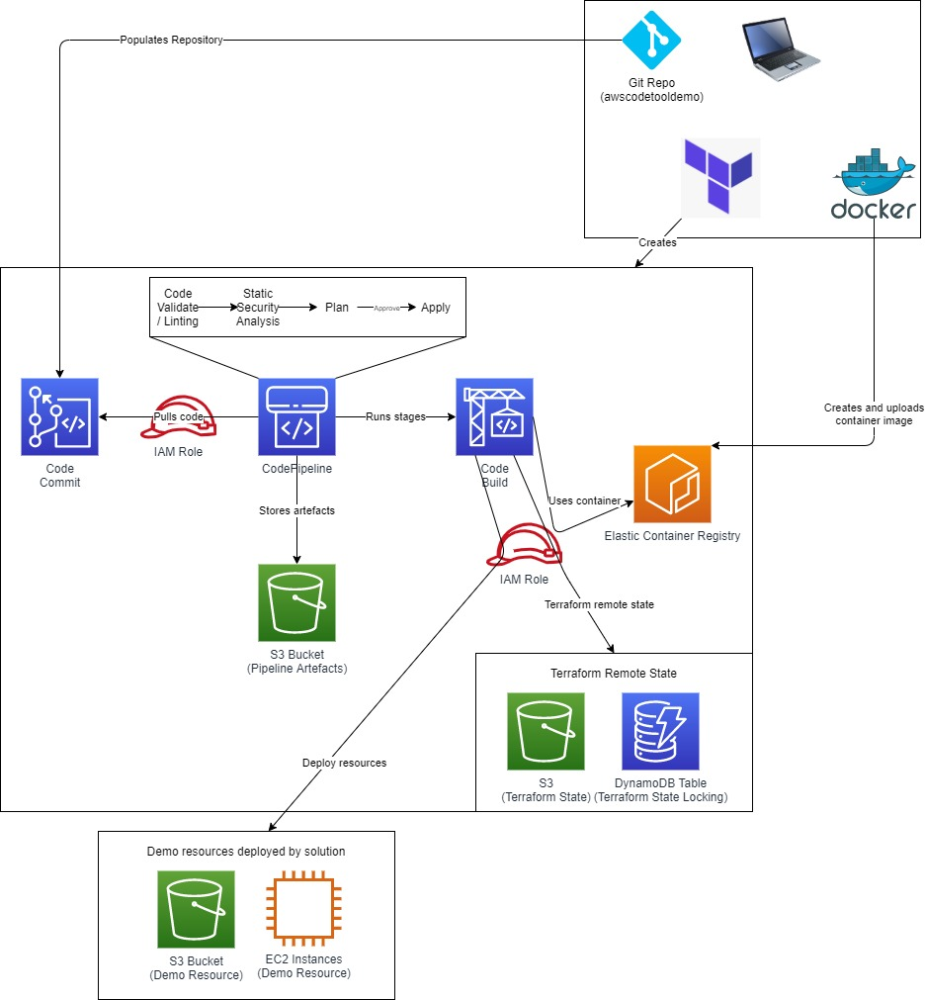

# awscodetooldemo
Demo of the AWS Code Tools

# Pre-reqs
Run code from Linux machine (tested with Centos)
AWS CLI
Terraform (greater than v1.0)
Docker
Git
AWS account with sufficient priveleges to deploy resources

# Deployment instructions
Login to AWS (e.g. access / secret access key), temporary command line credentials etc
Navigate to code-tool-creation folder
run 'terraform init'
run 'terraform apply'

# Overview
Demo code for using the AWS Code family to deploy resources using Terraform
To deploy additional resources create folders in the repo created in CodeCommit in repo/test and amend execute.txt to list the directory structure

## Requirements

| Name | Version |
|------|---------|
|  [terraform](#requirement\_terraform) | >= 1.0.0 |
|  [aws](#requirement\_aws) | >= 3.20.0 |

## Providers

| Name | Version |
|------|---------|
|  [aws](#provider\_aws) | >= 3.20.0 |
|  [local](#provider\_local) | n/a |
|  [null](#provider\_null) | n/a |
|  [template](#provider\_template) | n/a |

## Modules

No modules.

## Resources

| Name | Type |
|------|------|
| [aws_codebuild_project.codebuild_apply](https://registry.terraform.io/providers/hashicorp/aws/latest/docs/resources/codebuild_project) | resource |
| [aws_codebuild_project.codebuild_plan](https://registry.terraform.io/providers/hashicorp/aws/latest/docs/resources/codebuild_project) | resource |
| [aws_codebuild_project.codebuild_security](https://registry.terraform.io/providers/hashicorp/aws/latest/docs/resources/codebuild_project) | resource |
| [aws_codebuild_project.codebuild_validate](https://registry.terraform.io/providers/hashicorp/aws/latest/docs/resources/codebuild_project) | resource |
| [aws_codecommit_repository.repo](https://registry.terraform.io/providers/hashicorp/aws/latest/docs/resources/codecommit_repository) | resource |
| [aws_codepipeline.pipeline](https://registry.terraform.io/providers/hashicorp/aws/latest/docs/resources/codepipeline) | resource |
| [aws_dynamodb_table.tfstate_lock](https://registry.terraform.io/providers/hashicorp/aws/latest/docs/resources/dynamodb_table) | resource |
| [aws_ecr_repository.image_repo](https://registry.terraform.io/providers/hashicorp/aws/latest/docs/resources/ecr_repository) | resource |
| [aws_iam_policy.codebuild_policy](https://registry.terraform.io/providers/hashicorp/aws/latest/docs/resources/iam_policy) | resource |
| [aws_iam_policy.codepipeline_policy](https://registry.terraform.io/providers/hashicorp/aws/latest/docs/resources/iam_policy) | resource |
| [aws_iam_role.codebuild_role](https://registry.terraform.io/providers/hashicorp/aws/latest/docs/resources/iam_role) | resource |
| [aws_iam_role.codepipeline_role](https://registry.terraform.io/providers/hashicorp/aws/latest/docs/resources/iam_role) | resource |
| [aws_iam_role_policy_attachment.codebuild-attach](https://registry.terraform.io/providers/hashicorp/aws/latest/docs/resources/iam_role_policy_attachment) | resource |
| [aws_iam_role_policy_attachment.codepipeline-attach](https://registry.terraform.io/providers/hashicorp/aws/latest/docs/resources/iam_role_policy_attachment) | resource |
| [aws_s3_bucket.artifact_bucket](https://registry.terraform.io/providers/hashicorp/aws/latest/docs/resources/s3_bucket) | resource |
| [aws_s3_bucket.tf_bucket](https://registry.terraform.io/providers/hashicorp/aws/latest/docs/resources/s3_bucket) | resource |
| [local_file.global_vars](https://registry.terraform.io/providers/hashicorp/local/latest/docs/resources/file) | resource |
| [null_resource.create_ecr_image2](https://registry.terraform.io/providers/hashicorp/null/latest/docs/resources/resource) | resource |
| [null_resource.upload_to_codecommit](https://registry.terraform.io/providers/hashicorp/null/latest/docs/resources/resource) | resource |
| [aws_caller_identity.current](https://registry.terraform.io/providers/hashicorp/aws/latest/docs/data-sources/caller_identity) | data source |
| [aws_region.current](https://registry.terraform.io/providers/hashicorp/aws/latest/docs/data-sources/region) | data source |
| [template_file.global_vars](https://registry.terraform.io/providers/hashicorp/template/latest/docs/data-sources/file) | data source |

## Inputs

| Name | Description | Type | Default | Required |
|------|-------------|------|---------|:--------:|
|  [codebuild\_policy\_name](#input\_codebuild\_policy\_name) | Name of IAM policy for CodeBuild | `string` | `"codebuild-policy"` | no |
|  [codebuild\_role\_name](#input\_codebuild\_role\_name) | Name of IAM role for the CodeBuild | `string` | `"codebuild-role"` | no |
|  [image\_repo\_name](#input\_image\_repo\_name) | Name of container image repo | `string` | `"terraform"` | no |
|  [pipeline\_policy\_name](#input\_pipeline\_policy\_name) | Name of IAM policy for the pipeline | `string` | `"pipeline-policy"` | no |
|  [pipeline\_role\_name](#input\_pipeline\_role\_name) | Name of IAM role for the pipeline | `string` | `"pipeline-role"` | no |
|  [repo\_branch](#input\_repo\_branch) | Default branch of repo | `string` | `"main"` | no |
|  [repo\_name](#input\_repo\_name) | Name of repo | `string` | `"demo-repo"` | no |
|  [tags](#input\_tags) | Tags to apply to resources | `map(any)` | <pre>{   "Environment": "Code Tool Demo" }</pre> | no |

## Outputs

| Name | Description |
|------|-------------|
|  [image\_repo\_arn](#output\_image\_repo\_arn) | n/a |
|  [image\_repo\_url](#output\_image\_repo\_url) | n/a |
|  [registry\_id](#output\_registry\_id) | ECR Repo ID |
|  [registry\_url](#output\_registry\_url) | ECR Repo URL |
|  [repo\_arn](#output\_repo\_arn) | Repository ARN |
|  [repo\_clone\_url\_http](#output\_repo\_clone\_url\_http) | Repository clone url http |
|  [repo\_clone\_url\_ssh](#output\_repo\_clone\_url\_ssh) | Repository clone url ssh |
|  [repo\_id](#output\_repo\_id) | Repository ID |

## Author
Mark Ross (connect via [LinkedIn](https://www.linkedin.com/in/markjamesross/))

## License

See  [License](https://github.com/markjamesross/awscodetooldemo/blob/main/LICENSE)